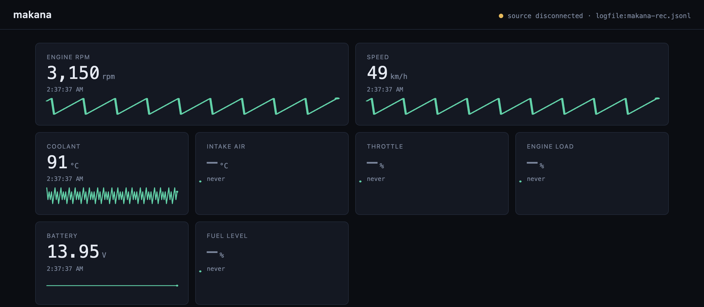
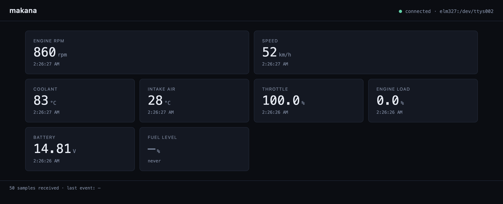

# makana

Vehicle telemetry platform. Read your car's data from anything that speaks to
it — OBD-II dongles, ESP32 firmware, recorded logs — serve it over WebSocket,
view it live in a dashboard.

> *makana* — مَكَنَة — Arabic for "engine."



*Dashboard against a recorded session replaying at 4×. Each gauge carries a
rolling 12-second sparkline so you see motion, not just the instantaneous
number. Zero hardware, zero emulator — the backend records any source to
JSONL and plays it back later.*



*Same dashboard, real ELM327 protocol. A Python emulator stands in for the
car; all seven polled PIDs populate (RPM, speed, coolant, intake, throttle,
engine load, battery). Swap the emulator for a real USB/Bluetooth dongle and
the same command works.*

## Quick start

```sh
cargo run -p makana-backend -- --transport mock
# open http://127.0.0.1:8080/
```

That's it — the mock source emits synthetic samples every 100 ms and the
dashboard renders them. When you're ready for the real ELM327 protocol:

```sh
# one-time emulator install
uv venv .venv
.venv/bin/python -m pip install 'setuptools<70'
.venv/bin/python -m pip install --no-build-isolation ELM327-emulator

# launch emulator (batch mode prints the pty path to the file)
.venv/bin/elm -b /tmp/elm.txt &
PTY=$(head -1 /tmp/elm.txt)

# point the backend at it
cargo run -p makana-backend -- --transport elm327 --device "$PTY"
```

Real car: plug in an ELM327 USB/Bluetooth dongle (`/dev/cu.usbserial-*` on
macOS, `/dev/ttyUSB0` on Linux) and use the same command with that device.

## Architecture

```
                    ┌── ELM327 dongle over serial (prod, passive)
                    │
   CarDataSource ───┼── ESP32 firmware over WS    (prod, CAN direct)
                    │
                    ├── ELM327 emulator           (dev, macOS-friendly)
                    │
                    └── Mock / replay log         (test)
        │
        │ Sample stream
        ▼
   backend (Axum) ── broadcast ──▶ WS clients (browser dashboard)
```

Everything is a `CarDataSource`. Firmware is just another transport — it runs
CAN on an ESP32 and forwards `Sample`s over WiFi. The backend doesn't know or
care where data came from, and the dashboard doesn't either.

## Layout

| Path                  | Purpose                                              |
| --------------------- | ---------------------------------------------------- |
| `crates/common`       | Shared types: `CanFrame`, `ObdValue`, `Sample`       |
| `crates/transport`    | `CarDataSource` trait + `MockSource`, `Elm327Source`, `LogSource` |
| `crates/backend`      | Axum HTTP/WS server + embedded static dashboard      |
| `crates/backend/web/` | Single-file HTML dashboard (no framework, no build)  |
| `firmware/`           | ESP32 firmware plan (see `firmware/README.md`)       |
| `docs/`               | README assets                                        |

## Status

- Mock source end-to-end: ✅ verified in browser
- ELM327 emulator end-to-end: ✅ integration test + browser-verified
- Log record + replay (JSONL): ✅ `--record` on any source, `--transport logfile` to play back
- DTC (Mode 03): ✅ decoder + wire format + dashboard panel (color-coded by P/C/B/U system)
- ELM327 reconnect: ✅ exponential backoff (500 ms → 30 s), auto-resumes on cable disconnect
- Configurable PIDs: ✅ `--pids 010C,010D,0105` selects what to poll
- PID auto-discovery: ✅ ECU is queried for supported PIDs at connect; polling list is filtered to the intersection (override with `--no-discover`)
- Recording rotation: ✅ `--record-rotate-mb N --record-keep K` for byte-counted rolling logs
- Dashboard sparklines: ✅ per-PID rolling 12-second history, no framework
- Real ELM327 dongle: untested (same code path — should just work)
- ESP32 firmware: designed, not started
- slcan / raw CAN: designed, not started

See [AGENTS.md](./AGENTS.md) for the full agent guide — architecture details,
conventions, wire format, testing, and workflow rules.


## Disclaimer

**Use at your own risk.** This software is provided as-is, with no warranty of
any kind (see [LICENSE](./LICENSE) for the legal version).

Today, makana is **read-only**: it queries standard OBD-II Mode 01 live data
and Mode 03 stored trouble codes. It does not write to the ECU, clear codes,
or perform any operation that modifies vehicle behavior.

Even so:

- Some poorly-designed ECUs can behave unexpectedly under diagnostic load.
  Real-world cases are rare, but they exist.
- **Do not interact with makana while driving.** Use it parked.
- Cheap or counterfeit OBD-II adapters can be electrically poor and have
  damaged OBD ports in extreme cases. Use a reputable adapter.

**If makana is ever extended to ECU write operations** — Mode 04 DTC clear,
UDS services, actuator tests, flashing, tuning — those operations can
permanently modify or brick your vehicle's electronics. Anyone enabling
such features is responsible for understanding what they do and accepting
the consequences.

Not affiliated with any car manufacturer. Trademarks belong to their
respective owners.

## License

[MIT](./LICENSE)